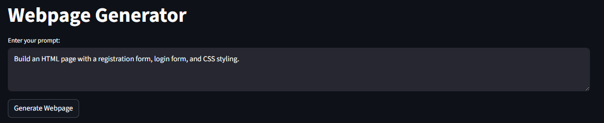
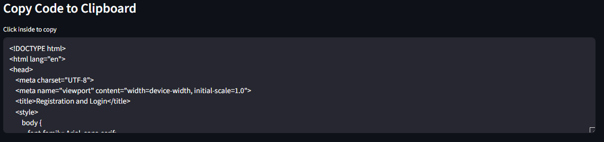
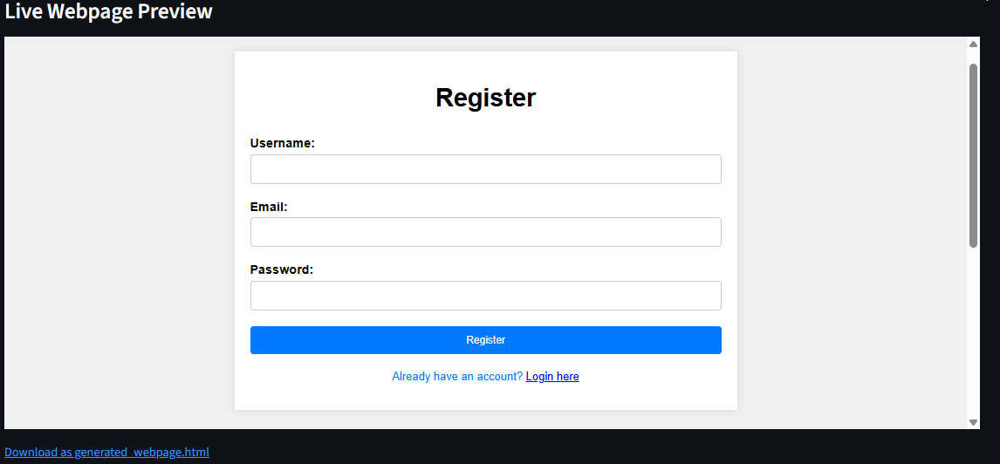

# GENAI Webpage Generator

A simple web app to generate HTML webpages using natural language prompts and Hugging Face models (Mixtral-8x7B-Instruct).

## Features

- Streamlit UI
- Prompt-based HTML generation
- Live preview
- Code export & download

###  Code Generation Output

###  Live Webpage Preview

